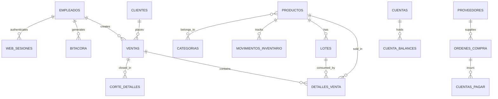
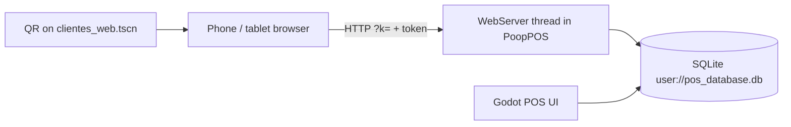
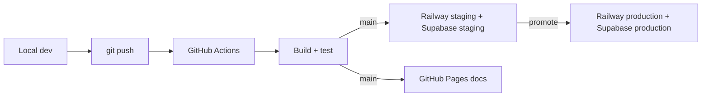

import { SystemContextDiagram } from '@site/src/components/diagrams';
import { ComponentArchitectureDiagram } from '@site/src/components/diagrams';
import { DeploymentArchDiagram } from '@site/src/components/diagrams';
import { SecurityModelDiagram } from '@site/src/components/diagrams';

# Architecture

This page is the single architecture reference for PoopPOS. It covers what ships today (a Godot 4.7 desktop POS with an embedded LAN web server and SQLite) and the rebuild target (NestJS + React 19 + Supabase). Each section states the legacy behavior, the verified source of truth, and how the rebuild replaces it.

Everything here was checked against the legacy source in `pooppos-legacy/` and the anonymized production dump `mockdb-schema.sql`. Where the earlier docs drifted from the code, this page records the real behavior. The [Godot legacy deep dive](./architecture/godot-legacy) keeps the long-form walkthrough.

## Current system compared to the rebuild target

| Layer | Current (legacy) | Target |
| --- | --- | --- |
| Runtime | Godot 4.7 (GDScript, Forward+) | NestJS (TypeScript) |
| Frontend | Godot Control scenes, custom `theme.tres` | React 19 (Vite) SPA |
| Database | SQLite file `user://pos_database.db` via `godot-sqlite` | PostgreSQL (Supabase) |
| Auth | PIN login + opaque web tokens | Supabase Auth (JWT + RLS) |
| Multi-client | Embedded HTTP server on the LAN | NestJS HTTP API + React SPA |
| Printing | TXT / OS generic / ESC/POS backends | Server-side receipt/PDF |
| Hosting | Desktop builds + itch.io + GitHub Pages `version.json` | Railway + Supabase + GitHub Pages |

Target stack:

| Layer | Technology | Purpose |
| --- | --- | --- |
| Frontend | React 19 | POS interface |
| Backend | NestJS | REST API server |
| Database | PostgreSQL (Supabase) | Persistent storage |
| Auth | Supabase Auth | JWT authentication and RLS |
| Hosting | Railway | API deployment |
| Docs | Docusaurus | This documentation site |
| Build | Turborepo | Monorepo task orchestration |

**Drag nodes to rearrange. Scroll to zoom. MiniMap in bottom-right.**

<SystemContextDiagram />

The [migration plan](./rebuild/migration-plan) maps each legacy module to the target. The [database reference](./operations/database) documents the target Postgres schema.

## UI

### Legacy: Godot scenes

Every screen is a `.tscn` plus a `.gd` script that `extends Control`, paired one-to-one. Navigation happens with `get_tree().change_scene_to_file("res://scenes/xxx.tscn")`; there is no root scene manager. The main scene is `res://scenes/login.tscn`.

Entities follow a fixed three-scene pattern:

- **List scene**: paginated table (10 rows per page), search, create/edit/delete, driven by the `paginated_list.gd` helper.
- **Form scene**: the edit form. The list sets `Database.editing_data = row` before navigating; the form reads it in `_ready()`.
- **Item scene**: `extends PanelContainer`, exposes `setup(data)` and emits `edit_clicked` / `delete_clicked`.

Screens are grouped by module folder under `scenes/`: `ventas_components/`, `gastos_components/`, `inventario_components/`, `clientes_components/`, `proveedores_components/`, `empleados_components/`, `cuentas_components/`, `ordenes_compra/`, `mobile_layout/`, and `utils/`.

Responsive behavior is ad-hoc: scripts resize in `_ready()` and on `get_viewport().size_changed`. Portrait layouts are duplicated scenes under `scenes/mobile_layout/` (roughly 98 percent duplicated code for `venta_form`, `venta_form_categoria`, and `gasto_form`).

The dark theme lives in `theme.tres` and is applied globally; some scripts still build `StyleBoxFlat` inline.

Primary screens:

| Screen | Purpose |
| --- | --- |
| `login.tscn` | PIN login, first-run setup, recovery |
| `main_menu.tscn` | Module menu, summary cards, inventory alerts, web indicator |
| `ventas.tscn` | Sales list, search, create, void |
| `venta_form.tscn` / `venta_form_categoria.tscn` | Classic cart / category grid sale entry |
| `gastos.tscn` / `gasto_form.tscn` | Expenses list and entry |
| `inventario.tscn` | Inventory hub: products, services, categories, lots |
| `productos.tscn` / `servicios.tscn` / `categorias.tscn` | Product, service, category management |
| `inventario_fisico.tscn` | Physical count with adjustment |
| `trazabilidad.tscn` | Per-product traceability and lot recall |
| `ordenes_compra/ordenes_compra.tscn` | Purchase orders |
| `clientes.tscn` / `proveedores.tscn` / `empleados.tscn` | Party directories |
| `cuentas.tscn` / `cuentas_pagar.tscn` / `monedas.tscn` | Accounts, payables, currencies |
| `reportes.tscn` / `reporte_detalle.tscn` / `productos_mas_vendidos.tscn` | Daily close and reports |
| `configuracion.tscn` | Settings, including web access, printing, backup |
| `clientes_web.tscn` | LAN web server control, QR, order queue, sessions |

### Target: React 19 SPA

The rebuild replaces scenes with React pages under a Vite build. Spanish stays the interface language, touch targets stay large, and reads stay offline-aware.

| Legacy scene | React target |
| --- | --- |
| `login.tscn` | `LoginPage` (Supabase Auth) |
| `main_menu.tscn` | Dashboard shell |
| `ventas.tscn` | `SalesHistoryPage` |
| `venta_form.tscn` / `venta_form_categoria.tscn` | `POSPage` |
| `inventario.tscn` / `productos.tscn` | `InventoryPage` |
| `clientes.tscn` | `CustomersPage` |
| `gastos.tscn` | `ExpensesPage` |
| `reportes.tscn` | `ReportsPage` |
| `empleados.tscn` | `EmployeesPage` |
| `categorias.tscn` | `CategoriesPage` |
| `configuracion.tscn` | `SettingsPage` |

## Domain

The legacy domain is nine modules. The functional reference in `pooppos/.agents/project.md` is the most complete map; below is the meaning of each module, in English.

| Module | What it does |
| --- | --- |
| **Ventas (Sales)** | Sales history, cart checkout (classic and category grid), quick sale overlay, discounts/manual charges/VAT, customer/account/currency, void with reason, FEFO lot consumption, product warnings, LAN web sales, configurable order-flow states |
| **Gastos (Expenses)** | Expense history and cart entry, quick expense, credit purchases that create payables, stock and lot intake from purchases |
| **Inventario (Inventory)** | Products, services, categories (many-to-many), lots and expiry, physical count, stock movement ledger, purchase orders, traceability and lot recall, low-stock and near-expiry alerts, CSV import |
| **Clientes (Customers)** | Customer CRUD, accumulated spend, CSV import |
| **Proveedores (Suppliers)** | Supplier CRUD, accumulated purchases, CSV import |
| **Empleados (Employees)** | Employee CRUD, PIN access, per-module permissions, PIN recovery, attribution on every operation |
| **Reportes (Reports)** | Daily close, period reports, pharmacy reports (top sellers, near-expiry, margins, sales by employee), activity log, web read reports |
| **Cuentas (Accounts)** | Cash/bank accounts, per-currency balances, transfers, accounts payable, currencies and exchange rates |
| **Configuracion (Settings)** | Business data, currencies/VAT/taxes, layout, tags and warnings, CSV import, web access, order flow, printing, backup/restore, reset, OTA updates, web security |

Cross-cutting rules that define the domain:

- **FEFO lots**: sales of lot-tracked products consume the nearest-expiry lot first. When a quantity exceeds the nearest lot, the sale splits into multiple `detalles_venta` rows, each carrying `lote_id`.
- **Parallel stock counters**: `productos.stock` and the sum of `lotes.cantidad` are two counters updated together. The web/POS availability badge uses `stock + lotes`, while physical availability is validated as `max(stock, sum(lotes))` in `crear_venta_web` to reject overselling.
- **Product warnings**: selling a product with active warnings opens a popup with an optional note; the note is stored in the sale description (desktop and web).
- **Multi-currency**: `configuracion.monedas_disponibles`, `moneda_principal`, and `tasas_cambio` (a JSON map) drive conversion. Account balances are stored per currency; payables keep their original currency.
- **VAT**: `tasa_iva` plus `iva_incluido` decide whether tax is added or already included. Configurable taxes and surcharges live in `impuestos_recargos`.
- **Activity log**: `insert_safe`, `update_row`, and `delete_row` write a readable entry to `bitacora_actividad`; detail and operational tables are excluded through `skip_logging_tables`.
- **Order flow**: when `configuracion.order_flow_enabled = "1"`, new sales (desktop, web, and web orders when charged) start in the first configured state in `ventas.flujo_estado`. The last state rests; moving a sale out of it completes it (`flujo_estado = NULL`). Default is off, so sales are born `completada`.

Target module mapping (server-side NestJS modules):

| Legacy area | Target module |
| --- | --- |
| `empleados` + `login.gd` | Auth + `UsersModule` |
| `productos` / `categorias` / `movimientos_inventario` | `InventoryModule` |
| `ventas` / `detalles_venta` | `SalesModule` |
| `gastos` / `detalles_gasto` | `ExpensesModule` |
| `clientes` / `proveedores` | `CustomersModule` / `SuppliersModule` |
| `configuracion` / `impuestos_recargos` | `SettingsModule` |
| `reportes.gd` | `ReportsModule` |
| `bitacora_actividad` | `AuditModule` (database triggers plus interceptors) |

<div style={{ marginTop: '2rem' }}>
<ComponentArchitectureDiagram />
</div>

## Persistence

### Legacy storage

The desktop app stores everything in one SQLite file at `user://pos_database.db`, opened by the `Database` autoload through the `godot-sqlite` GDExtension. The connection runs `PRAGMA foreign_keys = ON`, but the schema declares **no** foreign-key constraints, no explicit indexes, and no CHECK constraints. The production audit counted zero of each.

Startup order is fixed and idempotent: `_open_database()` then `_run_migrations()` then `_seed_defaults()`, plus legacy data migrations for recovery password, categories, and permissions. Tables use `CREATE TABLE IF NOT EXISTS`; missing columns are added by `_add_column_if_missing()`, which reads `PRAGMA table_info` first. Seeds insert only when a row is absent.

Concurrency: every query, fetch, CRUD call, and transaction is wrapped by `Database._db_lock` (a recursive `Mutex`), because the embedded web server queries SQLite from a second thread. User input always goes through parameterized bindings on the data paths that were checked; some legacy form lookups still interpolate strings (see the risk section).

Money columns are SQLite `REAL` (floating point), which carries rounding risk. PINs are stored as plaintext 4-digit strings.

### Real schema

The legacy source creates **32 tables** in `database.gd`. The production dump `mockdb-schema.sql` contains **38 tables**: the same 32 plus six that no code in the legacy source snapshot creates. The table below is the verified inventory.

| Table | Purpose | Notable columns |
| --- | --- | --- |
| `configuracion` | Key/value settings store (not a wide row) | `clave` PK, `valor` |
| `empleados` | Staff and login | `nombre`, `puesto`, `telefono`, `email`, `pin`, `permisos` (JSON) |
| `categorias` | Product categories | `nombre` |
| `productos` | Products and services | `precio`, `stock`, `stock_minimo`, `costo`, `codigo_barras`, `principio_activo`, `es_servicio`, `es_ilimitado`, `moneda`, `imagen_path`, `eliminado` |
| `producto_categorias` | Product to category (M:N) | `producto_id`, `categoria_id` |
| `producto_tags` | Free-text tags for search | `producto_id`, `tag` |
| `lotes` | Batches for FEFO | `producto_id`, `codigo_lote`, `proveedor_id`, `fecha_vencimiento`, `cantidad` |
| `movimientos_inventario` | Stock movement ledger | `producto_id`, `lote_id`, `tipo`, `cantidad`, `motivo`, `empleado_id`, `referencia_id` |
| `ajustes_inventario` | Physical count adjustments | `stock_sistema`, `stock_contado`, `diferencia`, `lote_id`, `motivo` |
| `clientes` | Customers | `nombre`, `codigo`, `identificacion`, `telefono`, `email`, `gasto_total` |
| `proveedores` | Suppliers | `nombre`, `codigo`, `telefono`, `email`, `gasto_con_proveedor` |
| `ventas` | Sales header | `fecha`, `total`, `cliente_id`, `tipo`, `estado`, `motivo_anulacion`, `cuenta_id`, `moneda`, `empleado_id`, `impuesto`, `flujo_estado` |
| `detalles_venta` | Sale lines | `venta_id`, `producto_id`, `cantidad`, `precio_unitario`, `subtotal`, `lote_id` |
| `gastos` | Expense header | `fecha`, `total`, `proveedor_id`, `tipo`, `cuenta_id`, `moneda` |
| `detalles_gasto` | Expense lines | `gasto_id`, `producto_id`, `cantidad`, `precio_unitario`, `subtotal` |
| `ordenes_compra` | Purchase orders | `proveedor_id`, `estado`, `total`, `moneda`, `cuenta_id`, `iva_included`, `iva_type`, `iva_value` |
| `detalles_orden` | Purchase order lines | `orden_id`, `producto_id`, `cantidad`, `precio_unitario`, `subtotal` |
| `cuentas_pagar` | Accounts payable | `proveedor_id` (nullable), `orden_id`, `monto`, `moneda`, `fecha_vencimiento`, `descripcion`, `estado`, `cuenta_pago` |
| `precios_proveedor` | Supplier prices per product | `producto_id`, `proveedor_id`, `precio`, `moneda` |
| `cuentas` | Cash/bank accounts | `nombre`, `descripcion`, `balance`, `monedas` |
| `cuenta_balances` | Balance per currency per account | `cuenta_id`, `moneda`, `balance` (composite PK) |
| `cortes` | Daily close | `fecha_inicio`, `fecha_fin`, `total_ventas`, `total_gastos`, `cantidad_transacciones`, `empleado_id`, `moneda_principal` |
| `corte_detalles` | Close to sale pivot | `corte_id`, `venta_id` |
| `corte_gastos` | Close to expense pivot | `corte_id`, `gasto_id` |
| `impuestos_recargos` | Configurable taxes/surcharges | `nombre`, `tipo`, `metodo`, `valor`, `aplicacion`, `incluido`, `activo` |
| `advertencias` | Product warning messages | `nombre`, `mensaje`, `activa` |
| `producto_advertencias` | Product to warning (M:N) | `producto_id`, `advertencia_id` |
| `ordenes_web` | Web orders queue | `cliente`, `notas`, `estado`, `total`, `moneda`, `empleado_id`, `venta_id` |
| `ordenes_web_detalles` | Web order lines | `orden_id`, `producto_id`, `cantidad`, `precio_unitario`, `subtotal`, `notas` |
| `bitacora_actividad` | Activity log | `fecha`, `usuario`, `actividad` |
| `web_sesiones` | Persisted web sessions | `token` PK, `device_id`, `empleado_id`, `nombre`, `creada`, `ultima_actividad`, `expira`, `dispositivo` |
| `order_flow_estados` | Configurable order states | `nombre` UNIQUE, `orden` |

Core DDL as actually created (the earlier legacy doc published a different shape):

```sql
CREATE TABLE IF NOT EXISTS productos (
    id          INTEGER PRIMARY KEY AUTOINCREMENT,
    nombre      TEXT NOT NULL,
    descripcion TEXT,
    precio      REAL DEFAULT 0.0,
    stock       INTEGER DEFAULT 0,
    categoria_id INTEGER,
    imagen_path TEXT,
    moneda      TEXT DEFAULT '$',
    es_servicio INTEGER DEFAULT 0,
    es_ilimitado INTEGER DEFAULT 0,
    eliminado   INTEGER DEFAULT 0
);
-- migrated in later: stock_minimo, fecha_vencimiento, codigo_barras,
-- principio_activo, costo

CREATE TABLE IF NOT EXISTS ventas (
    id               INTEGER PRIMARY KEY AUTOINCREMENT,
    fecha            TEXT NOT NULL,
    total            REAL DEFAULT 0.0,
    cliente_id       INTEGER,
    descripcion      TEXT,
    tipo             TEXT DEFAULT 'con_productos',
    estado           TEXT DEFAULT 'completada',
    motivo_anulacion TEXT,
    cuenta_id        INTEGER DEFAULT 1,
    moneda           TEXT DEFAULT '$'
);
-- migrated in later: empleado_id, impuesto, flujo_estado
```

The production dump adds these tables, which the verified source snapshot never creates:

| Table | Apparent purpose |
| --- | --- |
| `promociones` | Promotion definitions |
| `promo_productos` | Promotion to product pivot |
| `metodos_pago` | Payment methods |
| `producto_exclusiones_impuestos` | Product tax exclusions |
| `employee_shifts` | Employee schedules |
| `employee_clock_records` | Employee time clock |

> TODO: verify against source, which build creates `promociones`, `promo_productos`, `metodos_pago`, `producto_exclusiones_impuestos`, `employee_shifts`, and `employee_clock_records`, and which columns `ventas.impuestos_json`, `ventas.base_imponible`, `ventas.metodo_pago_id`, `productos.precio_abierto`, `productos.descuenta_balance`, and `cuentas.incluir_caja`. None appear in this legacy checkout; they exist only in the production dump.

Settings keys in `configuracion` include `monedas_disponibles`, `moneda_principal`, `tasas_cambio`, `tasa_iva`, `iva_incluido`, `negocio_nombre`, `negocio_rif`, `negocio_direccion`, `negocio_telefono`, `recovery_password_hash`, `web_server_enabled`, `web_server_port`, `web_orders_enabled`, `web_require_login`, `web_status_enabled`, `web_sales_enabled`, `web_access_key`, `order_flow_enabled`, plus the `printer_*`, `receipt_*`, and `escpos_*` printing keys.

Entity relationships (logical only; the schema enforces none):



### Target persistence

The rebuild moves to Supabase PostgreSQL, versioned under `supabase/migrations`. Every tenant-owned table carries a `business_id` foreign key and a Row-Level Security policy that resolves the tenant through a `SECURITY DEFINER` function, never by reading `business_id` from the JWT directly. Audit writes run through `SECURITY DEFINER` triggers so a closed INSERT policy cannot reject the trigger itself. See the [database reference](./operations/database) for the RLS pattern, `current_business_id()`, and the index list.

Data migration is an export, anonymize, transform, import, validate pipeline documented in the [migration plan](./rebuild/migration-plan).

## Printing

### Legacy printing subsystem

Printing was refactored from a single TXT writer into a modular subsystem under `scripts/printing/`, configured from `impresion.tscn`. The UI never builds receipt text or touches printers directly; it constructs an `InvoiceDocument` and calls `PrinterService`.

| Component | File | Role |
| --- | --- | --- |
| Invoice model | `invoice_document.gd` | `InvoiceDocument` plus `InvoiceItem`; loads business, employee, customer, and lot data; `from_sale_data()` |
| Result | `print_result.gd` | `PrintResult`: `success`, `error_code`, `user_message`, `technical_message`, `output_path`, `printer_name`, `backend`, `copies`, `content_type` |
| Service | `printer_service.gd` | Picks a provider by OS, applies copies, TXT fallback, busy guard, test print |
| Config | `printer_config.gd` | Persists keys in `configuracion`; enums for backend, transport, paper width |
| Backend base | `printer_backend.gd` | `render()`, `print()`, `can_print()` |
| TXT backend | `txt_backend.gd` | Renders plain text; saves `user://receipts/venta_N.txt` |
| Generic backend | `generic_backend.gd` | Sends rendered text through the OS queue |
| ESC/POS backend | `escpos_backend.gd` | Builds raw bytes; FILE, CUPS raw, or TCP output |
| CUPS provider | `cups_provider.gd` | `lpstat -a/-p/-d`, `lp -d -o raw -t`; forces `LC_ALL=C` |
| Windows provider | `windows_provider.gd` | `Get-Printer` / `wmic`, `print /d:`, `copy /b` to a share |
| Preview | `print_preview.gd` | Receipt preview from the same `InvoiceDocument` |

Three concepts stay separate: the **backend** decides rendering (TXT, generic text, ESC/POS), the **provider** discovers OS printers (CUPS on Linux, Windows provider, Android), and the **transport** decides where bytes go (file, CUPS queue, TCP). USB, network, and Bluetooth are not printer types.

Configuration lives in `configuracion` and is read/written by `PrinterConfig`. Defaults: printing disabled, backend TXT, transport file, 80 mm paper, 42 characters per line, `CP850`, 3 feed lines, auto-cut off, one copy, TXT copy enabled, automatic TXT fallback off. The settings screen lists installed printers, keeps `printer_name` persisted on selection and on test, and defaults the fiscal label to `RUC / RIF / NIT`.

`PrinterService.print_invoice()` behavior:

1. If printing is disabled, route straight to the TXT backend.
2. Otherwise build the configured backend and print `receipt_copies` copies.
3. On failure, if `txt_fallback_auto` is set, retry with the TXT backend.
4. On success, if `txt_fallback_enabled` is set and the backend is not TXT, also write a TXT copy.

A `_is_busy` flag rejects a second job while one is in flight, so repeated clicks do not queue duplicate prints. ESC/POS supports init, alignment, bold, feed, cut, codepage selection (CP437/850/852/858), configurable chars-per-line and paper width, and a minimal Latin-1 mapping for Spanish characters; logo, QR, barcode, and cash-drawer commands are not implemented. On Windows, RAW printing is flagged unsupported and TCP transport is the recommended path for ESC/POS. The legacy `scripts/utils/receipt_generator.gd` (`ReceiptGenerator`) still exists for direct TXT receipts, but the print button uses the subsystem.

### Target printing

Receipts move server-side: a NestJS endpoint generates a PDF or a print template from sale data, and the React client renders or downloads it. The invoice data model, lot lines, and VAT breakdown carry over; the transport and provider concerns drop away.

## Auth & Sessions

### Legacy desktop login

Login is PIN-based and minimal. `login.gd` reads `SELECT * FROM empleados WHERE pin = ? LIMIT 1`, sets `Database.current_user`, logs `Inició sesión`, and navigates to `main_menu.tscn`. The PIN is numeric and capped at 8 digits. There is **no PIN attempt lockout and no PIN cooldown**.

On a fresh install with no employees, the setup panel creates the first employee with `puesto = "Administrador"` and stores a SHA-256 hash of a recovery password in `configuracion.recovery_password_hash`.

Recovery is a single **global** recovery password, not per-employee security questions. Entering it (3 attempts, then a 15-minute lock) logs in as the first employee whose `puesto = 'Administrador'`, then prompts a PIN change. There is no security-question table.

Permissions are stored in `empleados.permisos` as a JSON array of module keys. `main_menu.gd` compares them against each button's `perm_key` metadata; an empty or null value grants full access. The server never validates permissions per endpoint, matching the desktop behavior.

Global state on the `Database` autoload: `current_user` (logged-in employee row), `editing_data` (row being edited, timing-sensitive), and `is_service_mode` (products vs services).

### Legacy web sessions

Web sessions use opaque tokens, not JWT, and they are **persisted in `web_sesiones`** so they survive POS restarts. The flow:

1. `POST /api/login` sends a PIN plus a `device_id`.
2. The server validates the PIN against `empleados`, then looks for a live session with the same `device_id` and `empleado_id`.
3. If one exists, the token is reused; otherwise a new token is created.
4. The token is passed as a `?token=` query parameter; the API itself is gated by `?k=` (`web_access_key`).
5. `GET /api/session/check?token=` validates a stored token without a PIN (silent browser re-login).
6. `POST /api/logout` deletes the device session.

Sessions use a sliding 24-hour TTL: `expira` is renewed on activity, with database writes throttled to once per minute per session. The database is the source of truth; the server keeps an in-memory cache as a fast path and falls back to the database on a cache miss. Regenerating `web_access_key` invalidates every session, in memory and in the database. The `dispositivo` label is derived from the browser User-Agent.

### Target auth

The rebuild replaces PIN and opaque tokens with Supabase Auth. PIN becomes email/password (optionally a PIN-to-email convenience), lockout becomes Supabase rate limiting, security questions are dropped (built-in email reset instead), and `web_sessions` is dropped in favor of short-lived JWTs with auto-refresh. Roles (`admin`, `supervisor`, `cashier`) map to RLS policies and `user_roles`.

<div style={{ marginTop: '2rem' }}>
<SecurityModelDiagram />
</div>

Security principles for the target: every request carries a JWT with the user id; Row-Level Security enforces tenant isolation in the database; the frontend never talks to the database directly; and audit logging captures sensitive operations server-side.

## Multi-client (web/LAN)

### Legacy embedded web server

`WebServer` (`scripts/web_server.gd`, autoload) runs an HTTP/1.1 server inside the same process, on a background `Thread`. It is built directly on `TCPServer` and `StreamPeerTCP` with no dependencies, and it processes connections one at a time. A connection that sends no data (a browser speculative connection) is closed after 3s (`IDLE_TIMEOUT_MS = 3000`) so it cannot block other clients.

- **Startup**: listens on `web_server_port` (default 8080) on all interfaces. It autostarts when `web_server_enabled = 1`.
- **Address discovery**: `detect_ip()` prefers the interface with the default route and discards virtual adapters (docker, bridges, VPN, tun/tap). `get_urls()` lists every candidate LAN IP for the "alternative links" shown in `clientes_web.tscn`.
- **Access control**: every `/api/*` call requires `?k=<web_access_key>`; a wrong or missing key returns 401. Static files (HTML/CSS/JS) are served without the key.
- **Static serving**: HTML/CSS/JS from `res://web/` in development, falling back to `user://web/` in production. POS icons for the web are served from `/ui/*`, falling back to `user://ui/`.

LAN topology:



Two web flows share the same server:

- **Orders queue**: a device creates an order with `POST /api/orders`; it appears in the POS queue. Orders do **not** touch stock when created. Stock is deducted with FEFO when the cashier charges the order (`Database.crear_venta_desde_orden_web`).
- **Direct web sales**: with `web_sales_enabled = 1`, a device does a full checkout in the browser. `POST /api/sale/quote` computes totals and stock, and `POST /api/sales` creates the sale through `Database.crear_venta_web`, which validates availability atomically inside the transaction (`max(stock, sum(lotes))`) and rolls back on shortage.

Server-side rules: prices are always re-read from SQLite and converted server-side, never trusted from the browser; limits are 50 items per order, quantity 1 to 999, and a 1 MB body cap. Order Flow state changes post to `/api/orderflow/estado`, and web clients poll `/api/orderflow` every 4s. The endpoint set:

| Method | Route | Notes |
| --- | --- | --- |
| GET | `/api/store/status` | Business name, currency, feature toggles |
| GET | `/api/categories` | Category list |
| GET | `/api/products` | Catalog with availability, tags, warnings |
| POST | `/api/login` | PIN + `device_id` to token |
| GET | `/api/session/check` | Validate stored token |
| POST | `/api/logout` | Drop the device session |
| GET | `/api/dashboard/summary` | Sales/expenses today, low stock, cash |
| GET | `/api/clientes` | Read-only customer search |
| GET | `/api/gastos` | Read-only expenses by day |
| GET | `/api/ventas` | Read-only sales by day |
| GET | `/api/orderflow` | Config plus in-flow sales |
| POST | `/api/orderflow/estado` | Set or advance state |
| POST | `/api/orders` | Create a web order |
| GET | `/api/orders/{id}` | Order status |
| GET | `/api/sale/options` | Currencies, accounts, charges, VAT, customers |
| POST | `/api/sale/quote` | Quote with per-line stock |
| POST | `/api/sales` | Create a direct web sale |
| GET | `/api/images/{archivo}` | Product images |

Sessions and access are described in [Auth & Sessions](#auth--sessions). The QR encodes the LAN URL and is generated in pure GDScript (`qr_generator.gd`, byte mode, ECC L, versions 1 to 6, up to 134 bytes). A floating `webclient_indicator` shows active devices, polls every 2s, and opens `clientes_web.tscn` when clicked with the `configuracion` permission.

**Asset embedding**: Godot does not pack raw HTML/CSS/JS or the original `.png`/`.svg` of imported resources into the export. To make the web survive an export, `scripts/utils/generate_web_assets.gd` embeds the `web/` tree as text and the 11 web icons as base64 into the generated `scripts/web_assets.gd` (about 1.4 MB). At startup, `WebServer._ensure_web_assets()` overwrites `user://web/` and `user://ui/` from that file. After editing `web/` or the web icons, regenerate with `godot --headless --path . -s res://scripts/utils/generate_web_assets.gd` before exporting.

The web frontend is vanilla JS/CSS (no framework): `index.html`, `css/style.css`, `js/api.js`, `js/cart.js`, `js/app.js`. It reuses the POS dark palette and icons.

### Target multi-client

The embedded server disappears. NestJS owns HTTP, the static frontend becomes the React SPA, and shared state moves to Postgres. Polling can be replaced by Supabase Realtime. Multi-instance use is expected, which the file-based SQLite design never supported.

## Deployment

### Legacy builds

`export_presets.cfg` defines three targets:

| Preset | Platform | Export path | Notes |
| --- | --- | --- | --- |
| Linux | Linux/X11 | `poopPOS 1.0.7 - Linux.x86_64` | `binary_format/embed_pck = true` |
| Windows Desktop | Windows | `poopPOS 1.0.5.exe` | Stale filename; app is 1.0.7 |
| Android | Android arm64 | `poopPOS.apk` | `version/name = 1.0.4`, `version/code = 6`, package `com.geraldglitch.pooppos` |

Every preset uses `export_filter = all_resources` and `binary_format/embed_pck = true`, so the PCK is embedded in the binary. The engine title is `poopPOS - 1.0.7`. There is no Web export preset; the earlier "Web build" claim was wrong.

Because raw assets are not packed, the exported production build served no web files. The HEAD commit, `correction prod server not working due to missing embeed files`, is the fix: the generated `web_assets.gd` embeds the web files so `WebServer` can seed `user://web/` and `user://ui/`. This is the deployment's most fragile point, since a forgotten regeneration ships a POS whose web mode serves nothing.

### OTA updates

`UpdateManager` (`scripts/utils/update_manager.gd`) checks two public URLs at startup from the login screen:

- `https://geraldglitch.github.io/pooppos-web/version.json` for the app version.
- `https://geraldglitch.github.io/pooppos-web/devmessage.json` for developer messages.

The local copy lives in `user://version.json` (falling back to `res://version.json`). The shipped `version.json` is `{ "version": "10", "devmessage": "1" }`. If the remote version integer is higher, a dialog offers to open the itch.io download page (`UpdateManager.ITCH_URL = https://geraldglitch.itch.io/pooppos`); if the remote `devmsj` is higher, a message dialog is shown once and the local value is bumped. The earlier "version 6" note was stale.

Distribution: desktop builds are published on itch.io, and `version.json`/`devmessage.json` plus the marketing landing page are hosted on GitHub Pages (`geraldglitch.github.io/pooppos-web`). The landing page is static HTML with Tailwind from a CDN and vanilla JS.

### Target deployment

The rebuild deploys the NestJS API to Railway and Postgres/Auth to Supabase, with this documentation on GitHub Pages. Domain: `mango-labs.dev`. Environment variables: `DATABASE_URL`, `SUPABASE_URL`, `SUPABASE_ANON_KEY`, `SUPABASE_SERVICE_KEY`, `NODE_ENV`, `PORT`. Rollback is a Railway redeploy of the previous build, a down migration or backup restore for the database, and a previous Pages build for docs. The [deployment guide](./operations/deployment) holds the full flow.



<div style={{ marginTop: '2rem' }}>
<DeploymentArchDiagram />
</div>

## Architectural risks & external dependencies

### Risks in the legacy system

| Risk | Impact |
| --- | --- |
| File-based SQLite | No concurrent multi-device writes; the web server serializes requests |
| No multi-tenant isolation | One business per database file |
| Plaintext PINs, 4 digits | Employee PINs are readable in the database |
| No PIN lockout | PIN guessing is unthrottled; only recovery is rate-limited |
| Opaque tokens, manual revocation | Sessions rely on a sliding 24h TTL and access-key regeneration |
| `REAL` money columns | Floating-point rounding risk on totals, VAT, and balances |
| No foreign keys, indexes, or CHECKs | No referential integrity or query indexes at the database layer |
| Parallel stock counters | `productos.stock` and `lotes.cantidad` must be updated together; drift is possible |
| Production dump ahead of source | Six tables and several columns exist in production but not in the code snapshot |
| Web asset embedding | A missed `generate_web_assets.gd` run ships a broken web mode |
| Sequential HTTP server | One slow client can delay others |
| Desktop/mobile scene duplication | Roughly 98 percent duplicated form code |
| String-interpolated lookups | Some legacy form queries still interpolate input; SQL injection remains a live class |
| No automated tests | No regression safety net |
| No server-side audit | Audit depends on client-side logging |

### External dependencies

| Dependency | Used for | Risk |
| --- | --- | --- |
| `godot-sqlite` GDExtension | All persistence | Native library per platform, updates to Godot can break ABI |
| CUPS (`lpstat`, `lp`) | Linux printer discovery and output | Requires CUPS; locale forced with `LC_ALL=C` |
| `Get-Printer` / `wmic` / `print` | Windows printer discovery and output | RAW printing unsupported; TCP recommended |
| ESC/POS network printer | Thermal receipts over TCP port 9100 | 5s connect timeout; no logo/QR/barcode |
| GitHub Pages (`pooppos-web`) | OTA version and dev messages | Public endpoint; no authenticity check on the payload |
| itch.io | Desktop download page | External distribution channel |
| Railway | Target API hosting | Platform dependency and cost |
| Supabase | Target Postgres, Auth, RLS | Platform dependency; RLS correctness is load-bearing |
