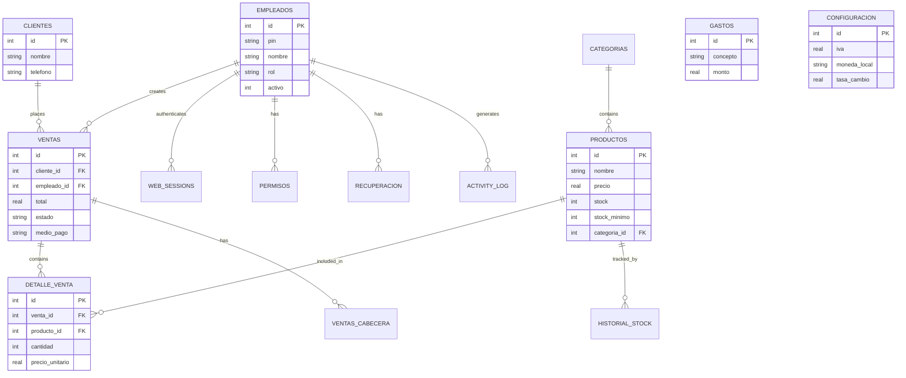

# Godot legacy codebase

:::note
This page documents the **current production codebase** — a Godot 4.7 desktop application with SQLite storage. The [migration plan](../rebuild/migration-plan) maps this system to the NestJS + React + Supabase target.
:::

## Overview

| Layer | Technology | Purpose |
| --- | --- | --- |
| Runtime | Godot 4.7 (GDScript) | Desktop application engine |
| Database | SQLite via `godot-sqlite` addon | All persistent data |
| Auth | PIN-based with token sessions | Employee login, web sessions |
| Web mode | Built-in `HTTPServer` | Browser-accessible POS |
| Export | Godot export templates | Windows, Linux, Web builds |

**Version:** 1.0.7 · **Export presets:** Windows Desktop, Linux/X11, Web

## Autoloads (singletons)

Every autoload is registered in `project.godot` and runs for the entire app lifecycle.

| Autoload | File | Role |
| --- | --- | --- |
| `Database` | `scripts/database.gd` | All SQLite operations — schema init, CRUD, reports |
| `WebServer` | `scripts/web_server.gd` | Token-based HTTP server for browser mode |
| `Alerts` | `scripts/alerts.gd` | UI notification toasts |
| `AppStyle` | `scripts/app_style.gd` | Theme/color management |
| `DateUtils` | `scripts/date_utils.gd` | Date formatting utilities |
| `WebAssets` | `scripts/web_assets.gd` | Serves static files (CSS/JS/images) to web clients |

## Scene structure

```
main.tscn                    Root scene (scene manager + viewport)
├── login/                   PIN-based auth screen
├── cajero/                  Main cashier / sales screen
├── ventas/                  Sales history + receipt print
├── inventario/              Product catalog management
├── clientes/                Customer directory
├── gastos/                  Expense tracking
├── reportes/                Sales & inventory reports
├── configuracion/           Business settings (IVA, currency, logo)
├── auth/                    Login helpers
├── empleados/               Employee directory + role assignment
├── categorias/              Product categories
├── proveedores/             Supplier directory
├── monedas/                 Multi-currency configuration
├── impuestos/               Tax rate management
├── barcode/                 Barcode scanning
├── ventas_acumuladas/       Accumulated sales view
└── web/                     Web-mode UI (HTML/CSS/JS templates)
    ├── index.html
    ├── css/main.css
    ├── js/app.js
    └── assets/               Logo and images
```

## Database schema (SQLite)

All tables are created by `Database._ready()` on first launch. The `godot-sqlite` addon runs SQL directly against a local `sqlite_base.db` file.

### Employees & auth

```sql
CREATE TABLE IF NOT EXISTS empleados (
    id          INTEGER PRIMARY KEY AUTOINCREMENT,
    pin         TEXT NOT NULL,
    nombre      TEXT NOT NULL,
    rol         TEXT NOT NULL DEFAULT 'cajero',
    activo      INTEGER NOT NULL DEFAULT 1,
    createdAt   TEXT NOT NULL DEFAULT (datetime('now','localtime')),
    -- roles: admin | encargado | cajero
);

CREATE TABLE IF NOT EXISTS recuperacion_preguntas (
    id            INTEGER PRIMARY KEY AUTOINCREMENT,
    empleado_id   INTEGER NOT NULL,
    pregunta      TEXT NOT NULL,
    respuesta     TEXT NOT NULL,
    FOREIGN KEY (empleado_id) REFERENCES empleados(id)
);
```

### Products & inventory

```sql
CREATE TABLE IF NOT EXISTS productos (
    id              INTEGER PRIMARY KEY AUTOINCREMENT,
    nombre          TEXT NOT NULL,
    precio          REAL NOT NULL,
    stock           INTEGER NOT NULL DEFAULT 0,
    stock_minimo    INTEGER NOT NULL DEFAULT 5,
    stock_maximo    INTEGER NOT NULL DEFAULT 9999,
    imagen          TEXT,
    codigo_barras   TEXT,
    categoria_id    INTEGER,
    activo          INTEGER NOT NULL DEFAULT 1,
    createdAt       TEXT NOT NULL DEFAULT (datetime('now','localtime')),
    FOREIGN KEY (categoria_id) REFERENCES categorias(id)
);

CREATE TABLE IF NOT EXISTS categorias (
    id        INTEGER PRIMARY KEY AUTOINCREMENT,
    nombre    TEXT NOT NULL,
    color     TEXT DEFAULT '#ffffff',
    imagen    TEXT
);

CREATE TABLE IF NOT EXISTS historial_stock (
    id              INTEGER PRIMARY KEY AUTOINCREMENT,
    producto_id     INTEGER NOT NULL,
    tipo            TEXT NOT NULL,  -- 'entrada' | 'salida' | 'ajuste'
    cantidad        INTEGER NOT NULL,
    motivo          TEXT,
    fecha           TEXT NOT NULL DEFAULT (datetime('now','localtime')),
    FOREIGN KEY (producto_id) REFERENCES productos(id)
);
```

### Sales

```sql
CREATE TABLE IF NOT EXISTS ventas (
    id              INTEGER PRIMARY KEY AUTOINCREMENT,
    cliente_id      INTEGER,
    empleado_id     INTEGER NOT NULL,
    total           REAL NOT NULL,
    total_me        REAL DEFAULT 0,          -- total in alternative currency
    impuesto_total  REAL DEFAULT 0,
    descuento       REAL DEFAULT 0,
    propina         REAL DEFAULT 0,
    estado          TEXT DEFAULT 'completada', -- completada | anulada
    medio_pago      TEXT DEFAULT 'efectivo',   -- efectivo | tarjeta | transferencia
    notas           TEXT,
    fecha           TEXT NOT NULL DEFAULT (datetime('now','localtime')),
    FOREIGN KEY (cliente_id) REFERENCES clientes(id),
    FOREIGN KEY (empleado_id) REFERENCES empleados(id)
);

CREATE TABLE IF NOT EXISTS detalle_venta (
    id          INTEGER PRIMARY KEY AUTOINCREMENT,
    venta_id    INTEGER NOT NULL,
    producto_id INTEGER NOT NULL,
    cantidad    INTEGER NOT NULL,
    precio_unitario REAL NOT NULL,
    subtotal    REAL NOT NULL,
    impuestos   REAL DEFAULT 0,
    descuento   REAL DEFAULT 0,
    FOREIGN KEY (venta_id) REFERENCES ventas(id),
    FOREIGN KEY (producto_id) REFERENCES productos(id)
);

CREATE TABLE IF NOT EXISTS ventas_cabecera (
    id              INTEGER PRIMARY KEY AUTOINCREMENT,
    venta_id        INTEGER NOT NULL,
    propina         REAL DEFAULT 0,
    descuento       REAL DEFAULT 0,
    impuesto_total  REAL DEFAULT 0,
    FOREIGN KEY (venta_id) REFERENCES ventas(id)
);
```

### Financial

```sql
CREATE TABLE IF NOT EXISTS gastos (
    id              INTEGER PRIMARY KEY AUTOINCREMENT,
    concepto        TEXT NOT NULL,
    monto           REAL NOT NULL,
    categoria       TEXT,
    fecha           TEXT NOT NULL DEFAULT (datetime('now','localtime')),
    notas           TEXT
);

CREATE TABLE IF NOT EXISTS clientes (
    id          INTEGER PRIMARY KEY AUTOINCREMENT,
    nombre      TEXT NOT NULL,
    telefono    TEXT,
    email       TEXT,
    direccion   TEXT,
    notas       TEXT,
    createdAt   TEXT NOT NULL DEFAULT (datetime('now','localtime'))
);

CREATE TABLE IF NOT EXISTS proveedores (
    id          INTEGER PRIMARY KEY AUTOINCREMENT,
    nombre      TEXT NOT NULL,
    telefono    TEXT,
    email       TEXT,
    direccion   TEXT,
    notas       TEXT,
    createdAt   TEXT NOT NULL DEFAULT (datetime('now','localtime'))
);
```

### Configuration

```sql
CREATE TABLE IF NOT EXISTS configuracion (
    id                  INTEGER PRIMARY KEY AUTOINCREMENT,
    iva                 REAL DEFAULT 0.15,
    utilidad_default    REAL DEFAULT 0.30,
    moneda_local        TEXT DEFAULT 'Cordobas',
    moneda_extra        TEXT DEFAULT 'Dolares',
    simbolo_local       TEXT DEFAULT 'C$',
    simbolo_extra       TEXT DEFAULT '$',
    tasa_cambio         REAL DEFAULT 1.0,
    logo_empresa        TEXT,
    abrir_caja          INTEGER DEFAULT 1,
    fondo_caja          REAL DEFAULT 0.0,
    numero_caja         TEXT DEFAULT '1'
);

CREATE TABLE IF NOT EXISTS monedas (
    id              INTEGER PRIMARY KEY AUTOINCREMENT,
    nombre          TEXT NOT NULL,
    simbolo         TEXT NOT NULL,
    tasa_cambio     REAL NOT NULL DEFAULT 1.0,
    es_principal    INTEGER NOT NULL DEFAULT 0
);

CREATE TABLE IF NOT EXISTS impuestos (
    id          INTEGER PRIMARY KEY AUTOINCREMENT,
    nombre      TEXT NOT NULL,
    porcentaje  REAL NOT NULL,
    activo      INTEGER NOT NULL DEFAULT 1
);
```

### Access control

```sql
CREATE TABLE IF NOT EXISTS permisos_empleados (
    id              INTEGER PRIMARY KEY AUTOINCREMENT,
    empleado_id     INTEGER NOT NULL,
    puede_ver       INTEGER DEFAULT 1,
    puede_editar    INTEGER DEFAULT 0,
    puede_eliminar  INTEGER DEFAULT 0,
    puede_anular    INTEGER DEFAULT 0,
    puede_cobrar    INTEGER DEFAULT 1,
    puede_reportes  INTEGER DEFAULT 0,
    puede_config    INTEGER DEFAULT 0,
    FOREIGN KEY (empleado_id) REFERENCES empleados(id)
);
```

### Session & audit

```sql
CREATE TABLE IF NOT EXISTS web_sessions (
    token       TEXT PRIMARY KEY,
    empleado_id INTEGER NOT NULL,
    rol         TEXT NOT NULL,
    created_at  TEXT NOT NULL DEFAULT (datetime('now','localtime')),
    FOREIGN KEY (empleado_id) REFERENCES empleados(id)
);

CREATE TABLE IF NOT EXISTS activity_log (
    id          INTEGER PRIMARY KEY AUTOINCREMENT,
    empleado_id INTEGER,
    accion      TEXT NOT NULL,
    detalle     TEXT,
    fecha       TEXT NOT NULL DEFAULT (datetime('now','localtime')),
    FOREIGN KEY (empleado_id) REFERENCES empleados(id)
);
```

### Entity relationships



## Web server API

`WebServer` (`scripts/web_server.gd`) exposes an HTTP server for browser-based access. Authentication uses opaque tokens (not JWT).

### Endpoints

| Method | Route | Auth | Description |
| --- | --- | --- | --- |
| GET | `/api/dashboard/summary` | Token | Sales totals, recent activity |
| GET | `/api/clientes` | Token | Customer list |
| GET | `/api/gastos` | Token | Expense list |
| GET | `/api/ventas` | Token | Sales history (with pagination) |
| POST | `/api/ventas` | Token | Create a sale (stock deducted atomically) |
| POST | `/api/ventas/anular` | Token | Void a sale (stock restored) |
| POST | `/api/ventas/siguiente` | Token | Advance order status |
| POST | `/api/login` | None | PIN login → returns session token |
| POST | `/api/logout` | Token | Invalidate session |
| POST | `/api/upload` | Token | Upload image (product/logo) |
| GET | `/assets/*` | None | Static files (CSS, JS, images) |

### Token auth flow

```
1. POST /api/login  { "pin": "1234" }
2. Server validates PIN against empleados table
3. Server creates web_sessions row with opaque token
4. Client sends token in Authorization header for all subsequent requests
5. POST /api/logout → deletes web_sessions row
```

## Key business modules

### Sales (`ventas.gd`)

- Paginated product list with search by name or barcode
- Cart with quantity adjustment, discounts, tips
- Multi-currency support (local `C$` / foreign `$` with exchange rate)
- IVA (15%) calculated per-item or globally based on config
- Receipt generation (`recibo` node) and invoice printing
- Order status flow: `pendiente → en_preparacion → listo → servido → pagado`
- Void/restock with admin PIN confirmation

### Inventory (`inventario.gd`)

- CRUD for products with image upload
- Stock level tracking with min/max thresholds
- Low-stock alerts on load
- Stock history via `historial_stock` table
- Category management with color coding

### Expenses (`gastos.gd`)

- CRUD with category classification
- Date-range filtering
- Summary totals

### Reports (`reportes.gd`)

- Sales summary (by date range)
- Inventory valuation
- Expense breakdown
- Net profit calculation (revenue − expenses − purchases)

### Configuration (`configuracion.gd`)

- IVA rate (default 15%)
- Default markup (30%)
- Multi-currency setup with exchange rates
- Business logo
- Cash drawer settings (opening fund, drawer number)

## Critical code paths

### Sale creation (`database.gd` → `insertar_venta`)

```gdscript
# Pseudocode — simplified
func insertar_venta(venta_data: Dictionary) -> int:
    db.open_db()
    db.insert_row("ventas", venta_data)
    var venta_id = db.last_insert_rowid
    for item in venta_data.detalle:
        item.venta_id = venta_id
        db.insert_row("detalle_venta", item)
        # Deduct stock
        db.update_row("productos",
            {"stock": item.producto_stock - item.cantidad},
            {"id": item.producto_id})
        # Log stock movement
        db.insert_row("historial_stock", {
            "producto_id": item.producto_id,
            "tipo": "salida",
            "cantidad": item.cantidad
        })
    db.close_db()
    return venta_id
```

### Auth (`login.gd`)

- PIN entry with 3-attempt lockout
- 10-second cooldown after lockout
- Recovery flow: answer security question → set new PIN
- PIN change for logged-in employees

## Limitations driving the migration

| Limitation | Impact |
| --- | --- |
| SQLite is file-based | No concurrent multi-device access |
| No multi-tenant isolation | Single business per database file |
| Godot export for web | Large bundle, limited mobile support |
| No server-side audit | Activity log is client-side only |
| Token auth is opaque | No expiry, no refresh, no revocation |
| Manual backup | No automated backups or replication |
| No real-time sync | Offline-first but no conflict resolution |
| GDScript only | Hard to hire, small ecosystem |
