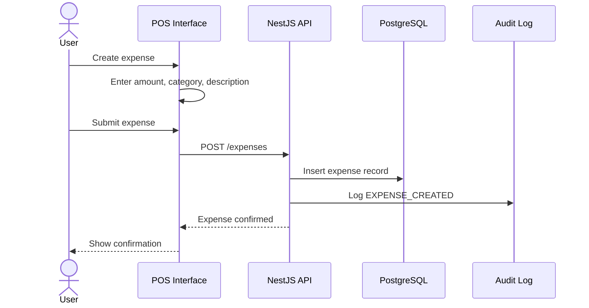

# Expense flow

Expense tracking provides visibility into business costs and supports financial reporting.

## Flow diagram

## Expense categories

| Category | Description | Examples |
| --- | --- | --- |
| Rent | Monthly rent | Local commercial space |
| Utilities | Services | Electricity, water, internet |
| Supplies | Office supplies | Paper, toner, cleaning |
| Maintenance | Equipment repair | POS hardware, furniture |
| Transport | Delivery/logistics | Fuel, shipping |
| Other | Uncategorized | Miscellaneous costs |

## Rules

- Every expense requires a description and category
- Expenses can be edited by Admin and Supervisor
- Only Admin can delete expenses
- All changes are audited
