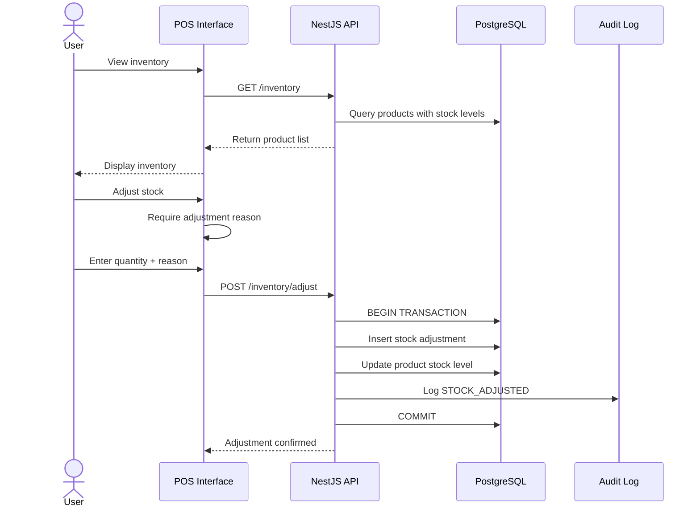
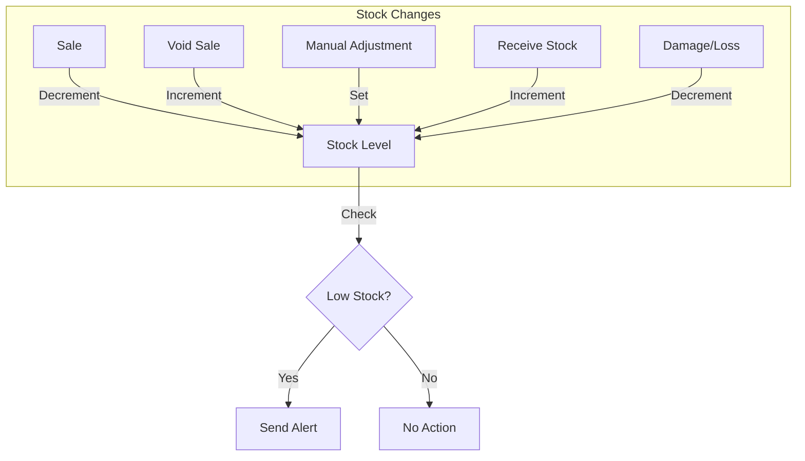

# Inventory flow

Inventory management ensures stock accuracy and prevents negative stock without authorization.

## Flow diagram

## Stock operations

## Low stock alerts

| Threshold | Action |
| --- | --- |
| Stock ≤ 0 | Critical alert — product unavailable |
| Stock ≤ low_stock_threshold | Warning alert — reorder needed |
| Stock > threshold | Normal — no action |

## Rules

- Do not permit negative stock without explicit authorization
- Every stock change requires a reason (stored in audit log)
- Stock adjustments are audited with before/after values
- Physical counts override system counts when reconciled
