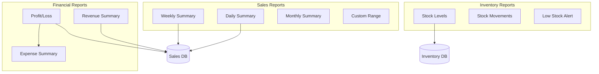
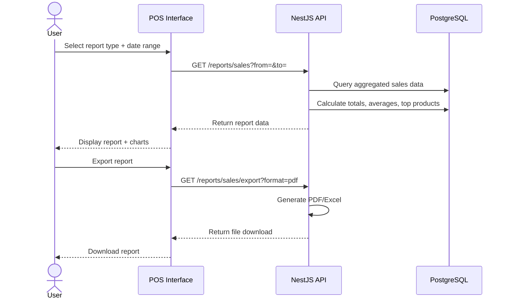

# Reporting flow

Reports provide business insights based on sales, inventory, and expense data.

## Report types

## Sales report flow

## Report access by role

| Report | Admin | Supervisor | Cashier |
| --- | --- | --- | --- |
| Daily summary (all) | ✅ | ✅ | ❌ |
| Daily summary (own) | ✅ | ✅ | ✅ |
| Weekly/monthly | ✅ | ✅ | ❌ |
| Custom range | ✅ | ✅ | ❌ |
| Stock levels | ✅ | ✅ | ✅ (read-only) |
| Profit/loss | ✅ | ✅ | ❌ |
| Export (PDF/Excel) | ✅ | ✅ | ❌ |

## Export formats

| Format | Use case |
| --- | --- |
| PDF | Formal reports, printing |
| Excel | Data analysis, accounting import |
| CSV | Raw data export |
