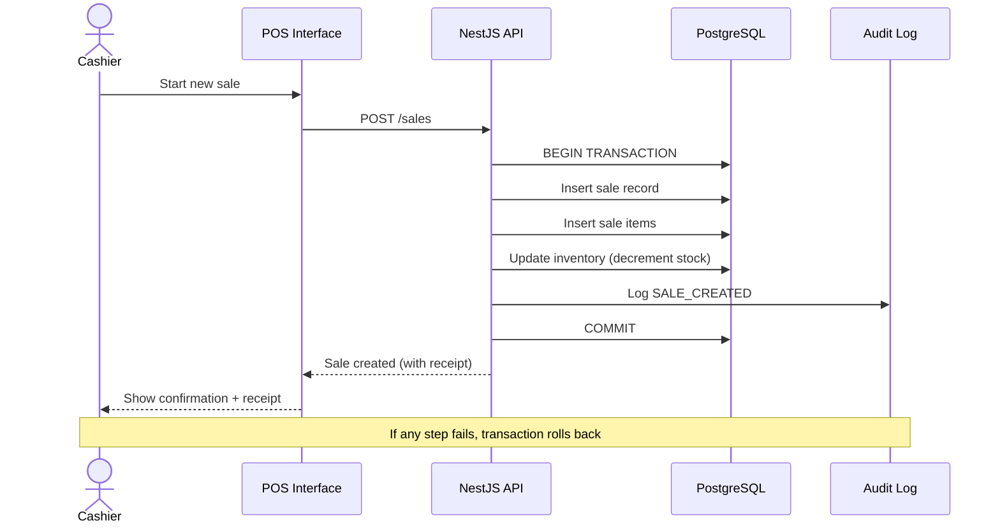
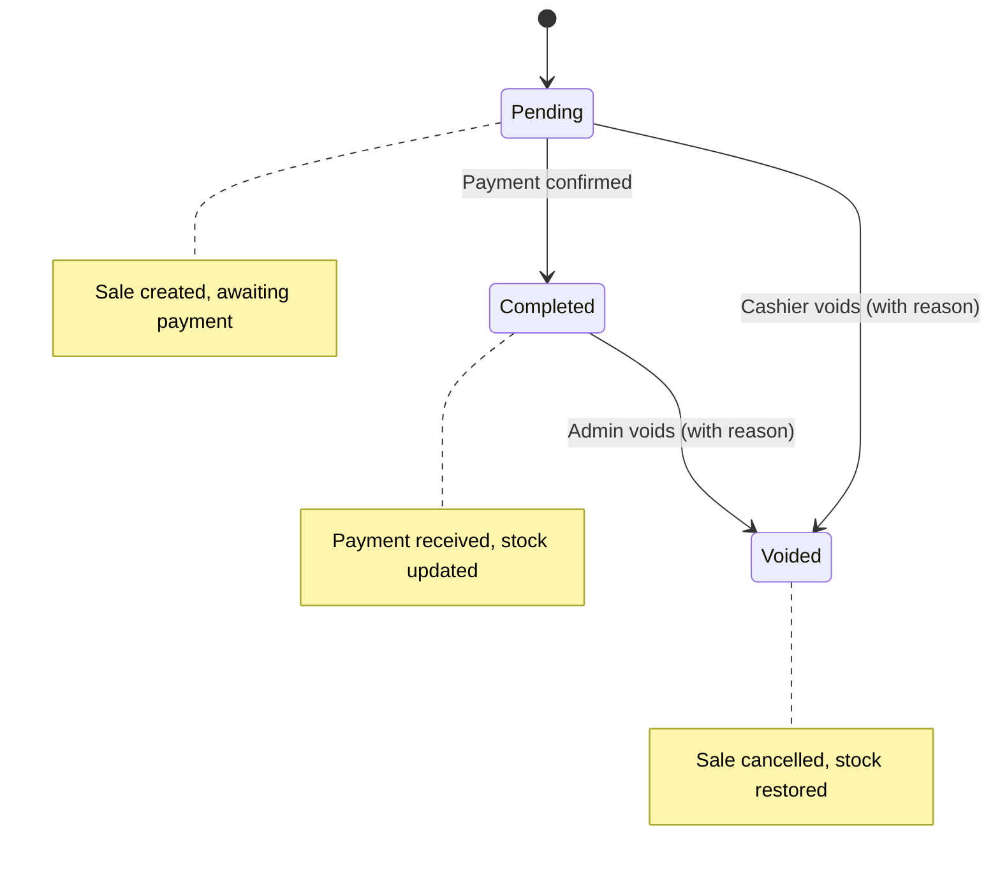
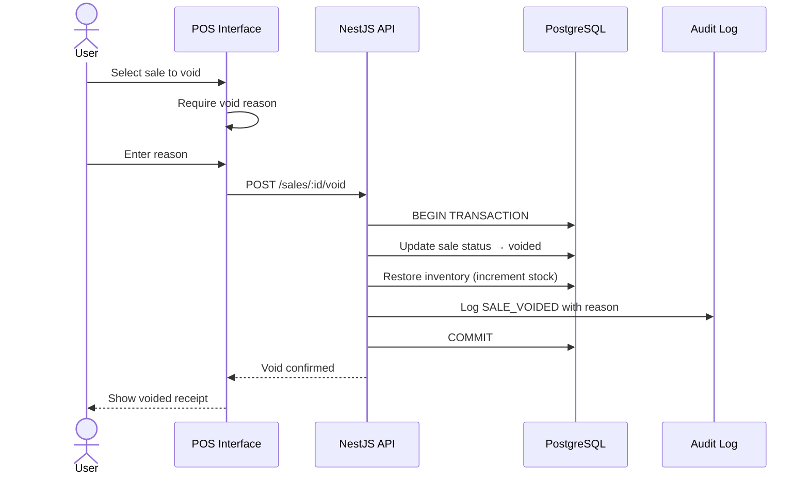

# Sale flow

The sale flow is the core business process. Every sale must be auditable and never silently changed or lost.

## Flow diagram

## Sale states

## Void flow

## Rules

- A confirmed sale is auditable and is never silently changed or lost
- Do not delete cancelled sales; record the cancellation
- Void requires a reason (stored in audit log)
- Stock is automatically restored on void
- Only Admin and Cashier can void (Cashier with reason, Admin without restriction)
