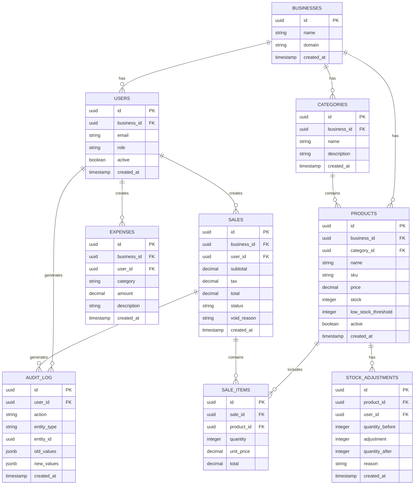

# Database schema

## Core entities



## Multi-tenant isolation

Every tenant-owned table includes a `business_id` foreign key, and Row-Level Security
filters queries by the authenticated user's business. Join tables (`sale_items`,
`stock_adjustments`) deliberately omit it and resolve tenancy through their parent, so
a tenant key can never drift between rows.

### Do not read `business_id` from the JWT

```sql
-- WRONG. Supabase does not put business_id in the JWT unless you build a
-- custom access-token hook. Without one this matches zero rows and every
-- query returns nothing, with no error.
CREATE POLICY products_own ON products
    FOR ALL USING (business_id = auth.jwt() ->> 'business_id');
```

Resolve the tenant through a `SECURITY DEFINER` function instead. `SECURITY DEFINER`
is required, not stylistic: `profiles` has its own RLS, so a policy on `profiles` that
queries `profiles` would recurse infinitely.

```sql
-- CORRECT — this is what migration 001 ships.
CREATE FUNCTION public.current_business_id()
RETURNS uuid
LANGUAGE sql
STABLE
SECURITY DEFINER
SET search_path = public
AS $$
    SELECT business_id FROM public.profiles WHERE id = auth.uid()
$$;

CREATE POLICY products_own ON public.products
    FOR ALL USING (business_id = public.current_business_id());
```

The same applies to trigger functions that write to a protected table. A
`SECURITY INVOKER` trigger is evaluated against the calling user's RLS policies, so a
trigger that inserts into a table whose `INSERT` policy is closed will have its own
write rejected. `audit_row_change()` is `SECURITY DEFINER` for that reason.

## Audit triggers

Every sensitive operation triggers an audit log entry:

```sql
-- Example audit trigger
CREATE OR REPLACE FUNCTION audit_sale_changes()
RETURNS TRIGGER AS $$
BEGIN
    INSERT INTO audit_log (user_id, action, entity_type, entity_id, old_values, new_values)
    VALUES (
        auth.uid(),
        TG_OP,
        'sale',
        NEW.id,
        CASE WHEN TG_OP = 'UPDATE' THEN to_jsonb(OLD) ELSE NULL END,
        to_jsonb(NEW)
    );
    RETURN NEW;
END;
$$ LANGUAGE plpgsql;
```

## Indexes

| Table | Index | Purpose |
| --- | --- | --- |
| `users` | `idx_users_business` | Multi-tenant filtering |
| `products` | `idx_products_business` | Multi-tenant filtering |
| `products` | `idx_products_category` | Category lookups |
| `sales` | `idx_sales_business_date` | Date-range queries |
| `sales` | `idx_sales_user` | User-specific queries |
| `audit_log` | `idx_audit_user` | User audit trail |
| `audit_log` | `idx_audit_entity` | Entity audit trail |
| `audit_log` | `idx_audit_created` | Time-based queries |
