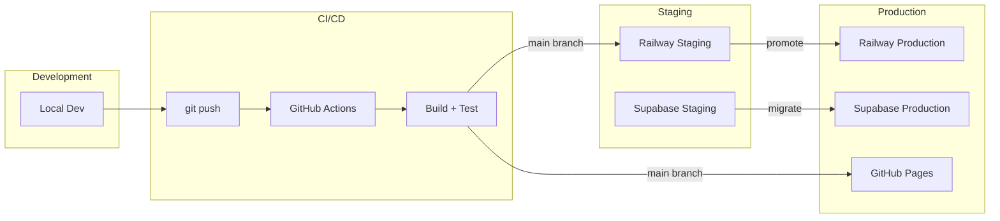

# Deployment guide

## Infrastructure

| Component | Provider | Environment |
| --- | --- | --- |
| API server | Railway | Staging + Production |
| Database | Supabase | Staging + Production |
| Auth | Supabase | Staging + Production |
| Documentation | GitHub Pages | Production |
| Domain | mango-labs.dev | Production |

## Deployment flow



## Environment variables

| Variable | Staging | Production | Description |
| --- | --- | --- | --- |
| `DATABASE_URL` | ✅ | ✅ | PostgreSQL connection string |
| `SUPABASE_URL` | ✅ | ✅ | Supabase project URL |
| `SUPABASE_ANON_KEY` | ✅ | ✅ | Supabase anonymous key |
| `SUPABASE_SERVICE_KEY` | ✅ | ✅ | Supabase service role key |
| `NODE_ENV` | production | production | Environment mode |
| `PORT` | auto | auto | Server port (Railway assigns) |

## Railway deployment

### Initial setup

```bash
# Install Railway CLI
npm install -g @railway/cli

# Login
railway login

# Link project
railway link

# Set environment variables
railway variables set DATABASE_URL="..."
railway variables set SUPABASE_URL="..."
railway variables set SUPABASE_ANON_KEY="..."
```

### Deploy

```bash
# Deploy to staging
railway up

# Deploy to production
railway up --environment production
```

## Supabase deployment

### Initial setup

```bash
# Install Supabase CLI
npm install -g supabase

# Login
supabase login

# Link project
supabase link --project-ref <project-id>

# Push migrations
supabase db push
```

### Migrations

```bash
# Create new migration
supabase migration new <migration_name>

# Apply locally
supabase db reset

# Apply to production
supabase db push
```

## Rollback procedure

| Component | Rollback method |
| --- | --- |
| API (Railway) | Redeploy previous version via Railway dashboard |
| Database | Run `down` migration or restore from backup |
| Auth | Revert to previous Supabase configuration |
| Documentation | Redeploy previous GitHub Pages build |

## Monitoring

| Metric | Tool | Threshold |
| --- | --- | --- |
| API response time | Railway metrics | < 500ms p95 |
| Error rate | Railway logs | < 1% |
| Database connections | Supabase dashboard | < 80% pool usage |
| Uptime | Railway health checks | 99.9% |
